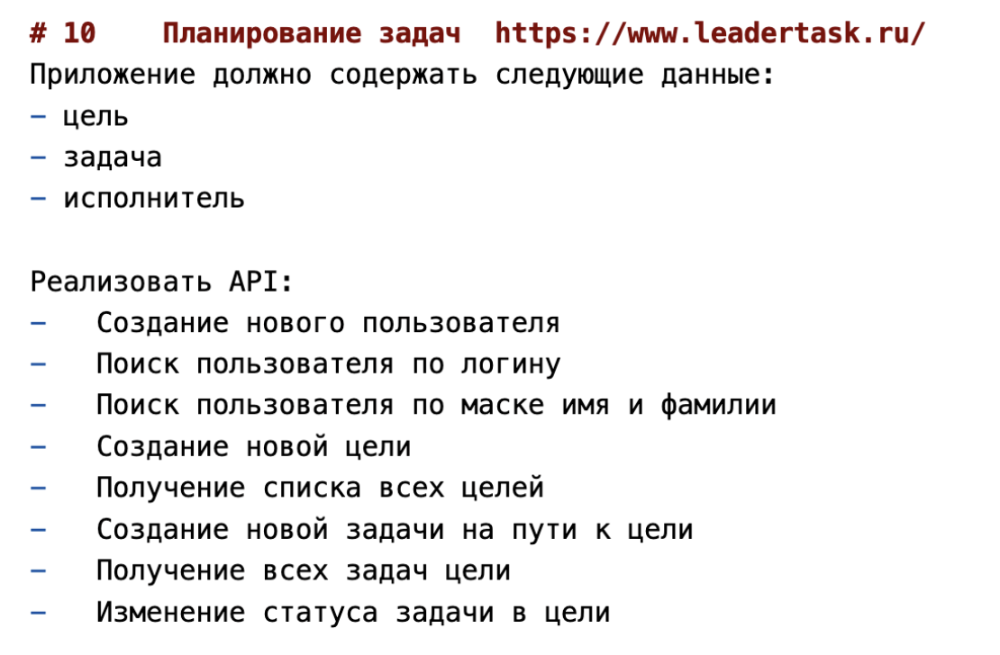
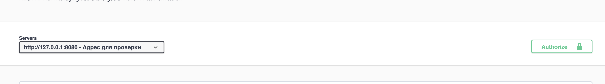
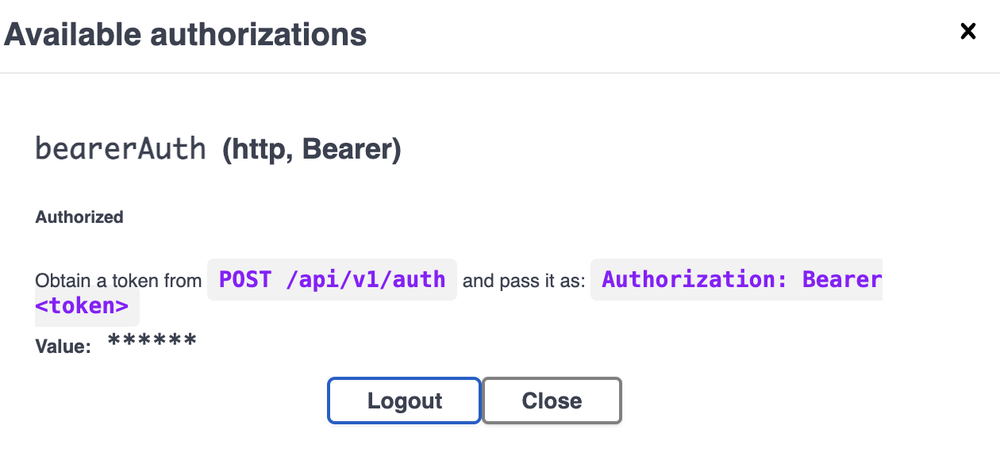

Вариант 10



Запуск для проверки  
---  
Для запуска нужно выполнить 2 команды.  
**Предварительно открыв терминал на уровне с docker compose для папки task3**

1) `docker compose up -d --build`

2) Для теста зайти на `http://127.0.0.1:8080/swaggerUI`

3) Для обновления использовать `docker compose down -v` (health checks могут занимать несколько секунд)

## **Важно**  

> файлы mongodb для задания в папке mongodb_for_bd

> Чтобы упросить процесс проверки дз - выключил JWT в методах, они доступны без авторизации.  


## Endpoints
---
> Swagger
- `GET /swaggerUI` \ `http://127.0.0.1:8080/swaggerUI` - Swagger для браузера с всеми ручками
- `GET /swagger.yaml` — OpenAPI спецификация в формате YAML без UI

Для ручек с Bearer нужно вызывать ручку **/auth**. (Может вызвать окно, где нужно **вставить admin secured**)  

 После чего полученный JWT скопировать и вставить в зеленый Authorization **(Не добавляя Barier)**

> Тогда можно будет увидеть, что мы его применили  
  


> Auth
- `POST /api/v1/auth` — Получение Barier токена для авторизации. Пароль `admin:secured` или `Basic YWRtaW46c2VjdXJlZA==`
> Users
- `POST /api/v1/users` — Добавление пользователя **(требует Bearer токен)**
- `GET /api/v1/users/login` — Получение информации о пользователе через логин
- `GET /api/v1/users/fullname` — Получение информации о существовании пользователя с таким именем и фамилией
> Goals
- `GET /api/v1/goals` — Получить все цели
- `POST /api/v1/goals` — Добавить новую цель **(требует Bearer токен)**

---

## Переменные окружения

- `JWT_SECRET` — секрет для подписи JWT токенов (обязательно для GET users и goals)

## Сборка

```bash
mkdir build && cd build
cmake ..
cmake --build .
```

## Запуск

```bash
./build/poco_template_server
```

## Docker

```bash
docker build -t poco_template_server .
docker run -p 8080:8080 -e LOG_LEVEL=debug poco_template_server
```

```bash 
# админка sql
psql -U postgres -d poco_template
```

```bash
{
  "_id": {
    "$oid": "69e53a9e534447850212f89e"
  },
  "id": {
    "$numberLong": "1"
  },
  "goal_id": "goal_123",
  "assignee_id": "user_456",
  "status": "pending",
  "text": "Пример текста задачи"
}
```