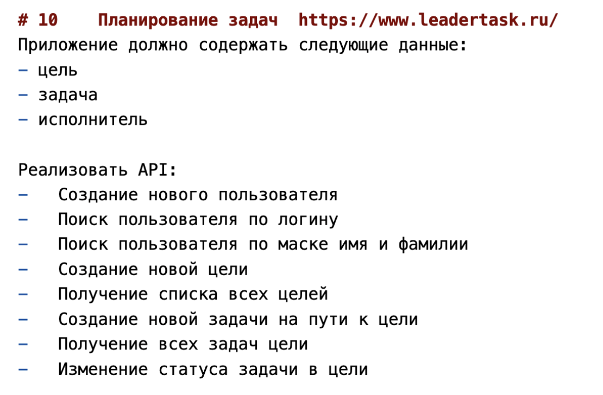

Вариант 10 
Овчинников Дмитрий 106 группа

Запуск для проверки  
---  
Для запуска нужно выполнить 2 команды.  
**Предварительно открыв терминал на уровне с docker compose для папки task3**

1) `docker compose up -d --build`

2) Для теста зайти на `http://127.0.0.1:8080/swaggerUI`

3) Для обновления использовать `docker compose down -v` (health checks могут занимать несколько секунд)

> 1 Анализ производительности  
Часто могут выполняться операции поиска по логину и полному имени.  
  
Для получения всех в списке как будто надо не перегружать кэш, а использовать пагинацию если необходима.  
  
Долгая операция - поиск по логину и фамилии с именем.  
  
Пропускная способность должна быть высокой, но надо учитывать что только один из типов объектов в задании использует монгу, что в теории замедляет время ответа.  

> 2 Проектирование стратегии кэширования  
Редко изменяется поиск по логину и полному имени т.к люди редко меняют их.  
Операции добавления противоречат кэшированию (только если не складывать сохраненное в кэш сразу)  
Список всех сущностей может часто изменяться и как будто не стоит его кэшировать  

Стратегия кэширования - Read-through (если не попали, то дальше идем в бд)    
  
И Write-through - сохранить в кэш актуальное при записи.  

ttl - минута (сгладить кучу запросов об одном пользователе, но не хранить долго)

Стратегия инвалидации кэша - данные не изменяются и не удаляются по заданию, поэтому кэш с использованием логина, имени и фамилии не устареет (объект не изменяем)  

Кэш инвалидируется редисом по времени.  

**Эндпоинты с кэшом - /api/v1/users/login, /api/v1/users/fullname**

> 3 Добавлен **rate limiter** для эндпоинта **/api/v1/users/fullname**
Для алгоритма TokenBucket (1 токен в ведре и один в секунду добавляется)
  
> 6 Кэширование снижает нагрузку на систему к которой обращаются.  
В данном случае снижает запросы к бд при активном общении с ней.
  
Но можно кэшировать какие-то результаты для более сложных операций, не только связанных с бд  
  
Rate Limiter создает backPressure. Т.е мы считаем что лучше уж сервис будет делать линейно стабильно ответы на запросы, чем за короткий промежуток времени получить кучу запросов но не смочь на них ответить за нужное время.  
  
Метрика для мониторинга производительности - Mean Response Time для ручек, либо по процентилям.  
  
Для проверки hit rate - узнать сколько в среднем количество попыток вычитывания из кэша к успешным. Дальше получить процент.  
Также замерить по времени обращение к кэш и к источнику данных или время выполнения сложной операции. И на основе этого оценить сколько тратится доп времени на этот cache miss.

**Описание кэширования в папке cache_for_bd**